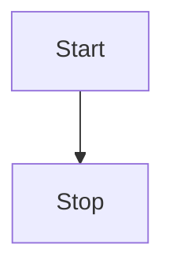

# vitepress-mermaid-plugin

为 VitePress 添加 Mermaid 图表支持，自动检测深色主题并切换 Mermaid 的渲染模式。

## 背景

本项目基于 [emersonbottero/vitepress-plugin-mermaid](https://github.com/emersonbottero/vitepress-plugin-mermaid) 进行修改升级。

原仓库最后一次发布是在 2022 年，至今（2026 年）已不再维护，且不支持 VitePress 2.x。在 VitePress 中使用 Mermaid，目前没有找到更好的替代插件，因此在原项目的基础上，借助 Claude Code 对代码进行了升级适配。

包名从 `vitepress-plugin-mermaid` 改为 `vitepress-mermaid-plugin`，原因是原包名的 npm 发布权限不在我手中，更名后才能独立发布到 npm 仓库。

感谢原作者 [emersonbottero](https://github.com/emersonbottero) 的工作。

## 安装

```bash
# npm
npm i vitepress-mermaid-plugin mermaid -D

# pnpm
pnpm add vitepress-mermaid-plugin mermaid -D
```

## 使用

在 VitePress 配置中添加：

```js
// .vitepress/config.js
import { withMermaid } from "vitepress-mermaid-plugin";

export default withMermaid({
  // 你的 VitePress 配置...
  mermaid: {
    // Mermaid 配置项，theme 在此处设置仅对亮色模式生效，深色模式会自动切换
  },
});
```

在任意 Markdown 文件中使用：

````md

````
